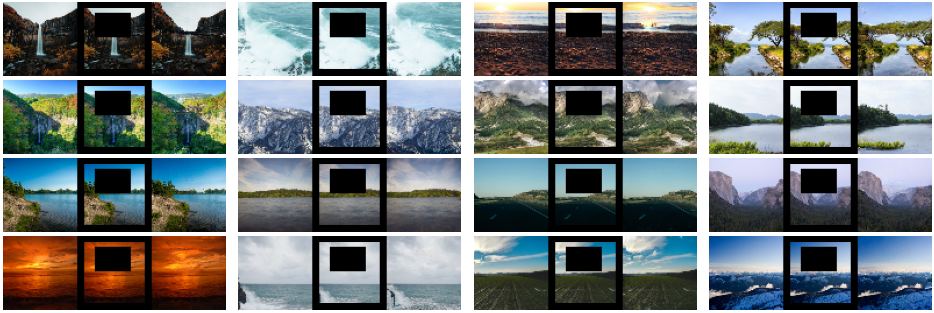
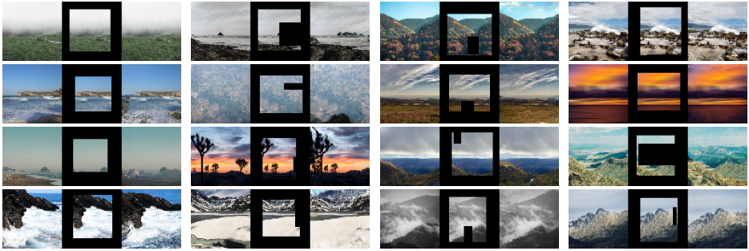

# Generative Fill Tensorflow & Keras

This work uses diffusion models to implement generative fill techniques like image unmasking, inpainting, expansion and 
various generative fill techniques. 

**Image inpainting (Original image, Masked image, Reconstructed image)** 

   

   

[Check out my DDPM implementation.](https://github.com/NITHISHM2410/diffusion-model-tf-ddpm)

## Target
 * [x] Reconstructing missing areas of images a.k.a image inpainting. 
 * [ ] Implement generative fill techniques with class and text guidance. 
 * [ ] Generative filling in latent space for High Resolution. 

## Acknowledgements

 - [LHQ Dataset](https://universome.github.io/alis)
 - [DDPM Official](https://github.com/hojonathanho/diffusion)

## Training & Generation demo

- [GenerativeFill](https://www.kaggle.com/code/nithishm2410/generativefill)

