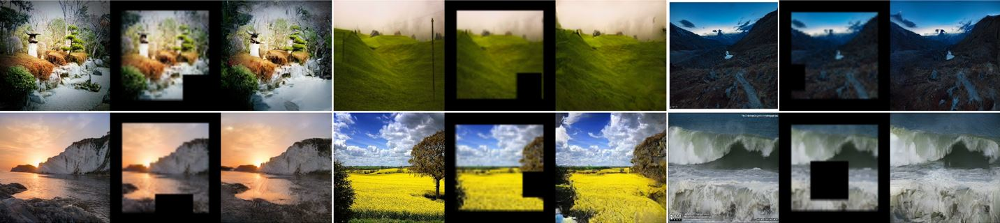
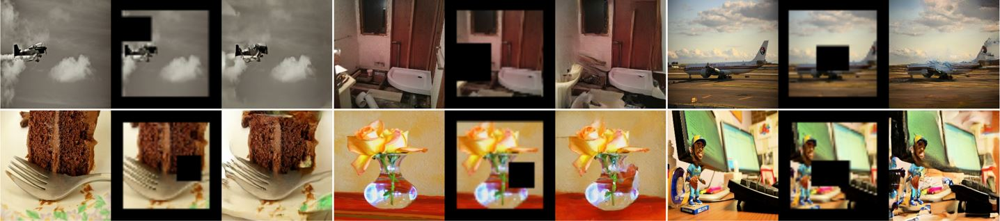

# Generative Fill Tensorflow & Keras

This work uses diffusion models to implement generative fill techniques like image unmasking, inpainting, expansion and 
various generative fill techniques. 

**Image inpainting (Original image, Masked image, Reconstructed image)** 
 
**DDPM generated (Trained and generated using Landscape dataset).** 

   

**LDM generated (Trained on COCO and generated using Landscape dataset).** 

   

**Sampling with COCO**

   

*More generated images can be found in results*

[Check out my DDPM implementation.](https://github.com/NITHISHM2410/diffusion-model-tf-ddpm)

## LDM & DDPM for GenFill

This repo includes generative filling using DDPM. To perform the same using LDM, checkout my LDM repo [here](https://github.com/NITHISHM2410/latent-diffusion-tf). 
The ldm-genfill folder in this repo only has the model config files to perform Generative filling using ldm models. So, use the implementation in my LDM repo with config 
files in this repo. Demo & other instructions for all LDM conditioning is available in the LDM repo.

Currently unmasked regions from DDPM looks more contextually relevant compared to LDM as DDPM directly works on images. Using Text and 
class conditioning to support GenFill slightly improves the ability of contextual fill and further training also may improve.
There may be plans to make improvements at a later time.

## Target(More may be added.)
 * [x] Reconstructing missing areas of images a.k.a image inpainting. 

 **Recent Updates**
 * [x] Implement generative fill techniques with class and text guidance. 
 * [x] Generative filling in latent space for High Resolution. 

## Acknowledgements

 - [LHQ Dataset](https://universome.github.io/alis)
 - [DDPM Official](https://github.com/hojonathanho/diffusion)

## Training & Generation demo

- [GenerativeFill using DDPM](https://www.kaggle.com/code/nithishm2410/generativefill).
- [LDM GenFill sampling dataset](https://www.kaggle.com/datasets/arnaud58/landscape-pictures).
- Checkout my [LDM repo](https://github.com/NITHISHM2410/latent-diffusion-tf) for LDM generative fill Demo.

