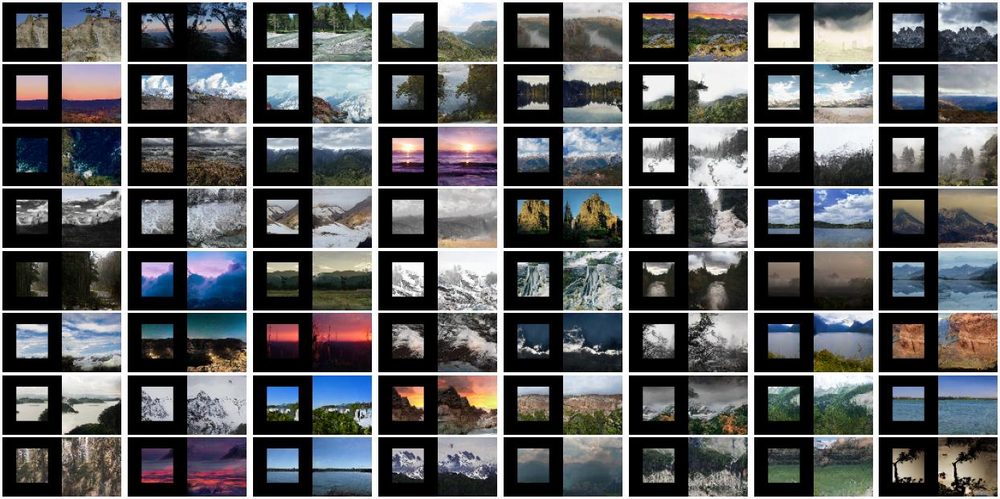

# Generative Fill Tensorflow & Keras

   

This work uses diffusion models to implement generative fill techniques like image unmasking, inpainting, expansion and 
various generative fill techniques. 

**Image unmasking** 
This model's forward diffusion is the same as that of the basic diffusion model; 
the difference lies in the reverse diffusion phase, where along with the noised version of the image, and the 
timestep we also feed the masked image to the model, and the model is made to predict the noise in the noised image 
using the masked image as a guidance.
 

During generation, we feed the three inputs (noised version of image, time step, masked image) to the model to 
predict & remove the noise throughout the diffusion timesteps.
 

[Check out my DDPM implementation.](https://github.com/NITHISHM2410/diffusion-model-tf-ddpm)

## Target
 * [x] Unmask the edges of images. 
 * [ ] Reconstructing different areas of images not just the edges a.k.a image inpainting. 
 * [ ] Implement other generative fill techniques. 
 * [ ] Generative filling in latent space. 
 * [ ] Applying the same high resolution images. 

## Acknowledgements

 - [LHQ Dataset](https://universome.github.io/alis)
 - [DDPM Official](https://github.com/hojonathanho/diffusion)

## Training & Generation demo

- [GenerativeFill](https://www.kaggle.com/code/nithishm2410/generativefill)

